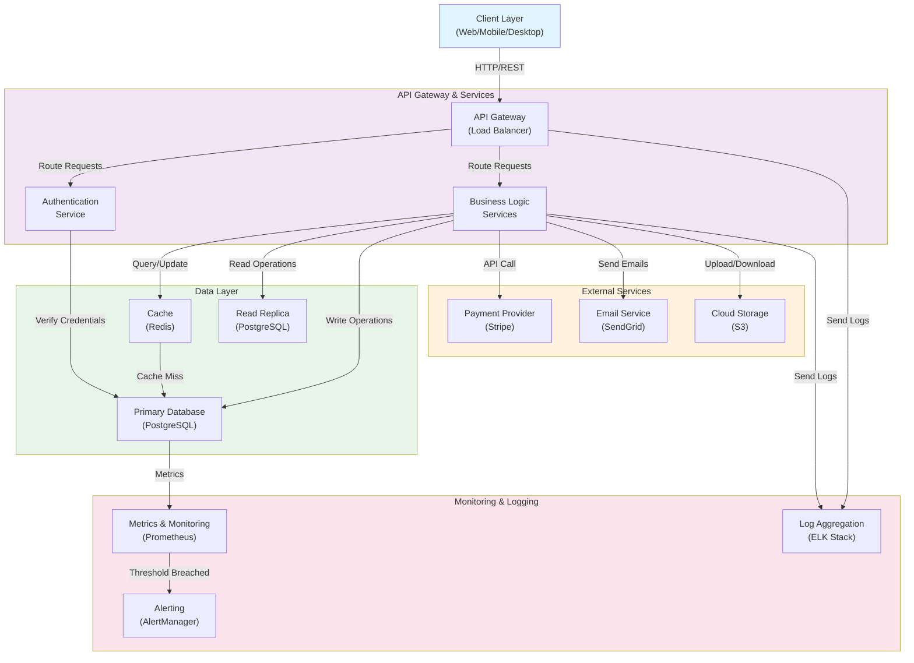

# Architecture Overview

This document provides a high-level overview of the system architecture and component interactions.

## System Architecture Diagram

## Component Description

### Client Layer
- Represents user-facing applications (web browsers, mobile apps, desktop clients)
- Communicates with the system via HTTP/REST APIs

### API Gateway & Services
- **API Gateway**: Central entry point handling load balancing, rate limiting, and request routing
- **Authentication Service**: Manages user authentication, session validation, and security tokens
- **Business Logic Services**: Core application services handling domain-specific operations

### Data Layer
- **Cache (Redis)**: In-memory data store for high-speed access to frequently used data
- **Primary Database (PostgreSQL)**: Main transactional database for persistent storage
- **Read Replica (PostgreSQL)**: Dedicated database replica for read-heavy operations to reduce load on primary

### External Services
- **Payment Provider (Stripe)**: Handles payment processing and transactions
- **Email Service (SendGrid)**: Manages email delivery for notifications and communications
- **Cloud Storage (S3)**: Stores user-generated files and media content

### Monitoring & Logging
- **Log Aggregation (ELK Stack)**: Centralized logging for troubleshooting and audit trails
- **Metrics & Monitoring (Prometheus)**: Collects system performance metrics and health indicators
- **Alerting (AlertManager)**: Triggers notifications based on predefined thresholds and anomalies

## Data Flow

1. **Request Ingestion**: Clients send requests through the API Gateway
2. **Authentication**: Requests are validated through the Authentication Service
3. **Processing**: Business Logic Services process the request
4. **Data Access**: Services query the Cache first, then the Database if needed
5. **External Integration**: Services may call external APIs for specialized operations
6. **Logging & Monitoring**: All operations are logged and metrics are collected
7. **Response**: Results are returned to the client

## Scalability Considerations

- **Horizontal Scaling**: API Gateway distributes load across multiple service instances
- **Caching Strategy**: Redis reduces database load for read-heavy operations
- **Database Replication**: Read replicas handle analytical and reporting queries
- **Microservices**: Independent services can be scaled based on demand
- **Monitoring**: Real-time alerts enable proactive issue resolution

## Deployment

This architecture supports:
- Container-based deployments (Docker/Kubernetes)
- Multi-region deployment for high availability
- Blue-green deployments for zero-downtime updates
- Automated rollback capabilities
